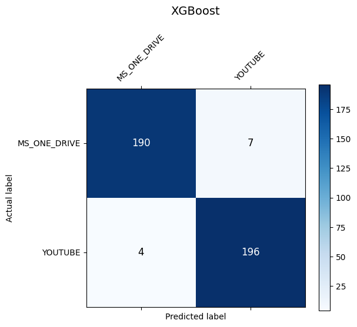
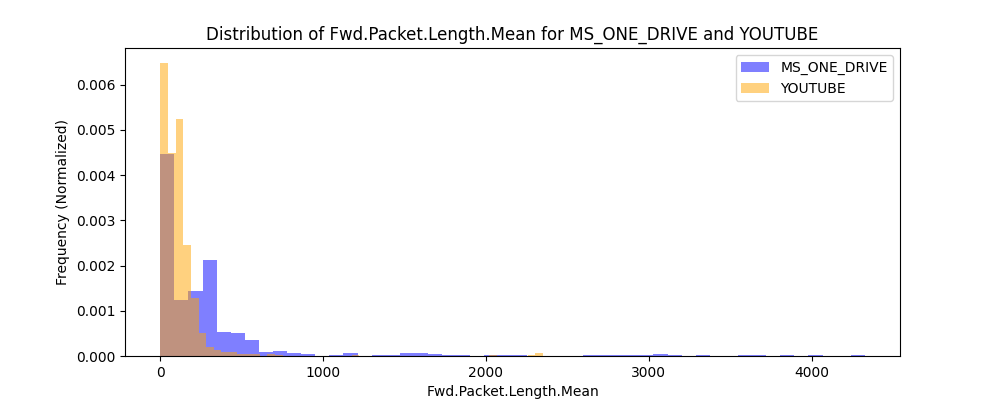

# Encrypted Traffic Classification using Machine Learning
> **Master's Project - Network Measurement Course @ Politecnico di Milano**

This repository contains a comprehensive machine learning pipeline designed to identify network applications from encrypted traffic flows without decryption. By analyzing statistical features (packet lengths, inter-arrival times), we classify traffic with high precision.

## 🚀 Key Highlights
- **High Accuracy:** Achieved **97.2% accuracy** using the XGBoost model.
- **Robust Generalization:** Successfully distinguished between diverse traffic types (Real-time vs. Bulk Storage).
- **Optimization:** Implemented automated hyperparameter tuning via **5-fold Cross-Validation**.
- **Efficiency:** Standardized data processing leading to **36x faster** convergence for linear models.

## 🛠 Tech Stack
- **Languages:** Python
- **ML Frameworks:** Scikit-learn, XGBoost
- **Data Analysis:** Pandas, NumPy
- **Visualization:** Matplotlib, Seaborn

## 📊 Methodology & Workflow
1. **Preprocessing:** Handling Infinity/NaN values and cleaning the dataset.
2. **Feature Engineering:** Logarithmic distribution analysis and Feature Standardization.
3. **Model Selection:** Comparison between **Logistic Regression** and **XGBoost**.
4. **Validation:** Evaluating performance using Accuracy, Precision, Recall, and F1-Score.

## 📈 Results & Visualizations
The project demonstrates that XGBoost significantly outperforms traditional linear models in identifying encrypted patterns.

| Model | Accuracy | Precision | F1-Score |
| :--- | :---: | :---: | :---: |
| Logistic Regression | 72.5% | 68.1% | 0.75 |
| **XGBoost** | **97.2%** | **96.5%** | **0.97** |

### Performance Analysis
Below is the Confusion Matrix for the **XGBoost** model, showing near-perfect classification across encrypted categories:

### Feature Distribution
Analysis of flow features (e.g., Packet Length Mean) revealed distinct signatures for different applications, enabling high-precision classification:

## 📂 Project Structure
- `NDA_Homework1_...ipynb`: Main Python notebook with documented code.
- `Features/`: Processed sub-datasets for specific app pairs.
- `Figures/`: Exported visualizations and performance charts.
- `22_apps_flow_features.csv`: Original dataset with 22 network protocols.

## 📜 License
This project is licensed under the MIT License.